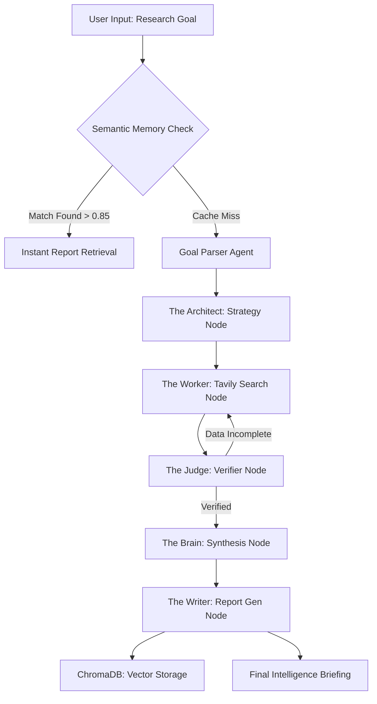

# 🛡️ HireIQ: Autonomous Multi-Agent Research Swarm

[](https://fastapi.tiangolo.com/)
[](https://reactjs.org/)
[](https://github.com/langchain-ai/langgraph)
[](https://www.trychroma.com/)
[](https://tailwindcss.com/)

**HireIQ PRO** is an agentic AI platform designed to automate high-fidelity recruitment research. Unlike standard chatbots, HireIQ utilizes a **multi-agent swarm** and **dual-persistence memory** to conduct real-time web discovery, semantic synthesis, and autonomous verification.

---

## 🚀 The Core Innovation: "Agentic Backtracking"
Most RAG (Retrieval-Augmented Generation) systems are linear. If they miss data, they fail. **HireIQ is cyclic.** 

Our **LangGraph-based DAG** architecture allows the system to:
1. **Self-Critique:** The "Judge" agent verifies if the findings meet the user's research goal.
2. **Backtrack:** If data is insufficient, the state is rewound, and the "Worker" is re-dispatched with a refinement prompt.
3. **Self-Heal:** Automatic retry loops handle API failures or empty search results without human intervention.

---

## 🧠 System Architecture



---

## 🛠️ Engineering Highlights

### 1. Semantic Memory Layer (ChromaDB)
To optimize costs and latency, we implemented a **Vector Cache**. Every research quest is embedded using `all-MiniLM-L6-v2`. Before launching a 40-second agent loop, the system checks ChromaDB. If a similar quest exists, it serves the report in **<100ms**, saving ~98% in compute costs.

### 2. Dual-Persistence Strategy
*   **Relational (SQLite):** Tracks task metadata, execution steps, and historical logs.
*   **Vector (ChromaDB):** Stores semantic embeddings for long-term knowledge retrieval.

### 3. Real-Time Pipeline Visualization
The frontend utilizes a state-driven dashboard that polls the backend API to show exactly which node in the graph is currently executing, providing full transparency into the "Agent's thoughts."

---

## 📦 Installation & Setup

### Prerequisites
* Python 3.10+
* Node.js 18+
* Groq API Key (Llama 3 70B)
* Tavily AI API Key

### Backend Setup
```bash
cd backend
python -m venv venv
source venv/bin/activate  # or venv\Scripts\activate on Windows
pip install -r requirements.txt
# Create a .env file and add your keys:
# GROQ_API_KEY=your_key
# TAVILY_API_KEY=your_key
python -m uvicorn src.api.main:app --reload --port 8000
```

### Frontend Setup
```bash
cd frontend
npm install
npm run dev
```

---

## 🎯 Example Quests
* *"Compare AI Engineer vs ML Engineer salaries and skills in Bangalore for 2026."*
* *"Find top hiring companies and salary ranges for Data Engineers in Hyderabad."*
* *"Research emerging tech skills in the Pune startup ecosystem."*

---

## 👨‍💻 Developed By
**Nikil R**  
*Backend & AI Engineer specializing in Multi-Agent Systems & RAG Architectures.*

---

## 📜 License
This project is for portfolio demonstration purposes only. MIT License.
