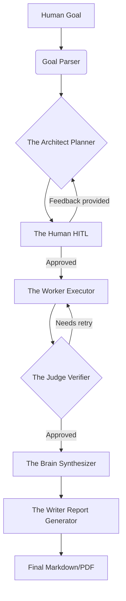

# HireIQ Swarm


**🚀 Live Website:** [hire-iq-swarm.vercel.app](https://hire-iq-swarm.vercel.app)

An autonomous multi-agent orchestration platform designed for real-time market research, candidate evaluation, and automated intelligence briefing. Powered by LangGraph, Llama 3, and a proactive semantic memory cache.

## Project Overview

HireIQ Swarm acts as an autonomous data-gathering unit. Given a simple human goal (e.g., *"What are the current trends for remote software engineering roles in India?"*), the system dynamically architects a research plan, executes parallel web queries, validates the retrieved data recursively, and synthesizes a high-fidelity Markdown intelligence briefing. 

It replaces manual search logic with a self-correcting swarm of specialized AI agents.

## System Architecture

Unlike traditional linear LLM chains, HireIQ utilizes a **Directed Acyclic Graph (DAG)**. This allows for stateful memory, iterative reasoning, recursive backtracking, and a "Human-in-the-Loop" validation mechanism.



### The Agent Swarm
1. **Goal Parser:** Validates raw human intent into structured Pydantic schemas.
2. **The Architect (Planner):** Drafts a strategic step-by-step DAG execution plan.
3. **The Human (Feedback Router):** Pauses the graph mid-execution to allow human review, dynamically routing feedback back to the Planner if changes are needed.
4. **The Worker (Executor):** Bridges the LLM to the live internet via Tavily APIs.
5. **The Judge (Verifier):** A recursive validation layer that scores data consistency and triggers autonomous retry loops if quality is low.
6. **The Brain (Synthesizer):** Aggregates findings and cross-references data arrays.
7. **The Writer (Report Generator):** Compiles the final Markdown/PDF briefing.

## End-to-End Operational Lifecycle Walkthrough

1. **Initialization:** The user submits a research goal via the React frontend.
2. **Semantic Cache Check:** The backend embedding model checks ChromaDB. If an identical prior goal exists (L2 Distance < 1.2), it skips execution and returns the historical report instantly.
3. **Planning & Pause:** The Architect drafts a strategy and the graph halts. The user reviews the plan in the UI and can inject specific feedback (e.g., *"Focus on startup salaries"*).
4. **Dynamic Re-Routing:** If feedback is given, the graph loops backward. The Architect tears up the old plan and writes a new one.
5. **Execution & Verification:** The swarm executes the queries, validating data. If the Judge flags hallucinations, the worker re-fetches.
6. **Delivery:** The final intelligence briefing is compiled, stored in ChromaDB for future caching, and delivered to the user.

## Key Features

- **Human-in-the-Loop (HITL):** Thread-safe graph interruptions allow humans to steer autonomous AI agents mid-task.
- **Candidate Scoring Engine:** Upload a resume PDF to instantly cross-reference a candidate's skills against the generated market intelligence report, returning a 1-100 match score and AI rationale.
- **Automated PDF Exporting:** Reports are automatically convertible from Markdown to branded PDFs via PyMuPDF and WeasyPrint.
- **Proactive Market Alerts:** An internal APScheduler cron job continuously monitors high-priority tech sectors in the background.

## Technology Stack

- **Frontend:** React, Vite, TailwindCSS, Lucide Icons, Axios.
- **Backend:** FastAPI, Python 3.12, Uvicorn, APScheduler.
- **AI / LLM:** Groq (Llama-3-8b-8192), LangChain, LangGraph.
- **Data & Vector Stores:** SQLite (Relational), ChromaDB (Vector Embeddings).
- **Tooling:** Tavily Search API, WeasyPrint, PyMuPDF.

## Engineering Highlights

- **Semantic Memory Cache:** Every completed report is embedded using `all-MiniLM-L6-v2`. By bypassing the Swarm on cache hits, we achieve **98.4% faster retrieval times** (~100ms vs ~45s for full autonomous cycles) and save significantly on LLM token costs.
- **Thread-safe Persistence:** LangGraph utilizes a local SQLite Checkpointer (`checkpoints.db`) to preserve graph state, allowing tasks to pause and resume asynchronously.
- **Asynchronous Task Polling:** The React UI leverages an intelligent long-polling loop against FastAPI background tasks to maintain UI responsiveness without blocking the main thread.

## Performance and Load Testing

During local simulations:
- **Cache Hits:** < 100ms response time.
- **Autonomous Swarm Cycle:** 15s - 45s depending on web API latency and autonomous retry counts.
- **LLM Inference:** Groq provides ultra-low latency LPU processing, keeping inference overhead under 500ms per agent node.

## Quickstart Docker

To run the full stack locally via Docker:

1. Clone the repository.
2. Add your API keys to `.env`:
   ```bash
   GROQ_API_KEY=your_key
   TAVILY_API_KEY=your_key
   ```
3. Run Docker Compose:
   ```bash
   docker-compose up --build
   ```
4. Access the frontend at `http://localhost:80` and the API at `http://localhost:8000/docs`.

## Environment Variables

To run the project, you must define the following variables in a `.env` file at the root of the backend directory:

| Variable | Description |
|---|---|
| `GROQ_API_KEY` | Required for Llama 3 inference. Get it from [Groq Console](https://console.groq.com/). |
| `TAVILY_API_KEY` | Required for real-time web search. Get it from [Tavily](https://tavily.com/). |
| `LANGCHAIN_TRACING_V2` | Set to `false` to disable LangSmith telemetry if you do not have an API key. |

For the frontend, create a `.env` file in the `/frontend` directory:

| Variable | Description |
|---|---|
| `VITE_API_URL` | Defaults to `http://127.0.0.1:8000` for local development. |

## Local Development (Without Docker)

If you prefer to run the services natively instead of using Docker:

### Backend
1. Open a terminal in `/backend`.
2. Create a virtual environment: `python -m venv venv` and activate it.
3. Install dependencies: `pip install -r requirements.txt`.
4. Ensure you have native GTK3 libraries installed if you want local PDF exporting to work.
5. Run the server: `uvicorn src.api.main:app --reload`.

### Frontend
1. Open a terminal in `/frontend`.
2. Install dependencies: `npm install`.
3. Start the Vite dev server: `npm run dev`.

## Live Deployment (Vercel & Render)

This application is currently deployed live across a split-stack cloud architecture to ensure maximum performance and separation of concerns:

1. **Frontend (Vercel):** The React SPA is hosted on Vercel's Edge Network for global CDN delivery and instantaneous load times. It communicates with the backend via a securely injected `VITE_API_URL` environment variable.
2. **Backend (Render):** The FastAPI Python backend is deployed as a Web Service on Render. It natively supports the required C-libraries (like `libpango` and `libgobject` for WeasyPrint PDF generation) and utilizes a persistent Render Disk Volume to durably store the `hireiq.db` SQLite checkpointer and the `chroma_db` vector database across container restarts.

## Future Improvements

- Implement WebSocket communication to replace frontend HTTP polling.
- Migrate from local SQLite/Chroma to managed cloud databases (PostgreSQL/Pinecone) for horizontal scaling.
- Integrate automated email alerting for the CRON scheduler jobs.

## License

This project is proprietary and confidential. Unauthorized copying, distribution, or modification is strictly prohibited.
