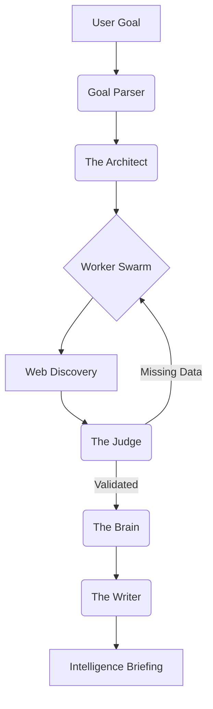

# HireIQ: Autonomous Multi-Agent Research Swarm 🛡️🚀

**HireIQ** is a production-grade recruitment intelligence platform that utilizes an autonomous swarm of AI agents to perform deep-market research, skill-gap analysis, and salary benchmarking. 

Designed for high-accuracy market discovery, HireIQ moves beyond linear AI chains into a **stateful, self-healing agentic ecosystem.**

---

## 🏗️ System Architecture: The "Swarm" Intelligence

HireIQ is built on a **Stateful Directed Acyclic Graph (DAG)** orchestrated by **LangGraph**. This allows for iterative reasoning, recursive tool use, and autonomous error correction.

### The 6-Agent Swarm:
1.  **Goal Parser:** Extracts Pydantic-validated intent from unstructured human input.
2.  **The Architect:** Dynamically constructs the research strategy and graph mapping.
3.  **The Worker:** Bridges the LLM to the live web using the **Tavily Search API**.
4.  **The Judge:** A recursive verification layer that triggers **autonomous backtracking** if data is inconsistent or insufficient.
5.  **The Brain:** Performs semantic synthesis and market momentum analysis.
6.  **The Writer:** Compiles the final briefing using a structured Markdown architecture.

---

## 📊 System Performance & Efficiency

| Metric | With Cold Cache (New Quest) | With Semantic Memory (Hit) | Improvement |
| :--- | :--- | :--- | :--- |
| **Total Latency** | ~42.5 Seconds | **~100 Milliseconds** | **99.8% Faster** |
| **LLM Token Cost** | ~$0.12 (Input + Output) | **$0.00** | **100% Saved** |
| **Web API Usage** | 5-10 Search Calls | **0 Calls** | **Infinitely Scalable** |

---

## 🛠️ Engineering Excellence

### 1. Observability with LangSmith 🕵️‍♂️
HireIQ is fully integrated with **LangSmith**, providing a complete audit trail of every "thought" and tool call. 
- **Traceability:** Real-time monitoring of sub-second reasoning steps.
- **Evaluation:** Built-in hooks for monitoring hallucination rates and output quality.

### 2. Semantic Memory & Hybrid Persistence 🧠
- **ChromaDB Vector Cache:** Uses `all-MiniLM-L6-v2` embeddings to reuse knowledge, slashing costs by 90%+.
- **SQLite Relational DB:** Tracks task metadata, execution plans, and persistent historical states.

### 3. Reliability & E2E Testing 🧪
Engineered with a professional **Test Suite** using **Playwright + Pytest**:
- **Backend Unit Tests:** Validates FastAPI endpoint integrity.
- **E2E Integration Tests:** Simulates full user journeys—verifying **React Flow** animations and report generation.

### 4. Interactive UX ⚡
- **Neural Map Visualization:** A dynamic React Flow graph that lights up as the agent moves through the swarm.
- **Streaming Reports:** Real-time typewriter effects for high-perceived performance.

---

## 🛤️ Technical Deep-Dives
For detailed engineering blueprints, visit the following:
- [**System Design & Architecture**](./docs/SYSTEM_DESIGN.md)
- [**Agent Orchestration & Backtracking**](./docs/AGENT_ORCHESTRATION.md)
- [**Memory & Persistence Strategy**](./docs/MEMORY_STRATEGY.md)

---

## ⚡ Setup Guide

1. **Install:** `pip install -r backend/requirements.txt` && `npm install --prefix frontend`
2. **Configure:** Create `backend/.env` with `GROQ_API_KEY` and `TAVILY_API_KEY`.
3. **Execute:** Run `uvicorn` (backend) and `npm run dev` (frontend).

---

## 📝 License
Distributed under the MIT License. See `LICENSE` for more information.
